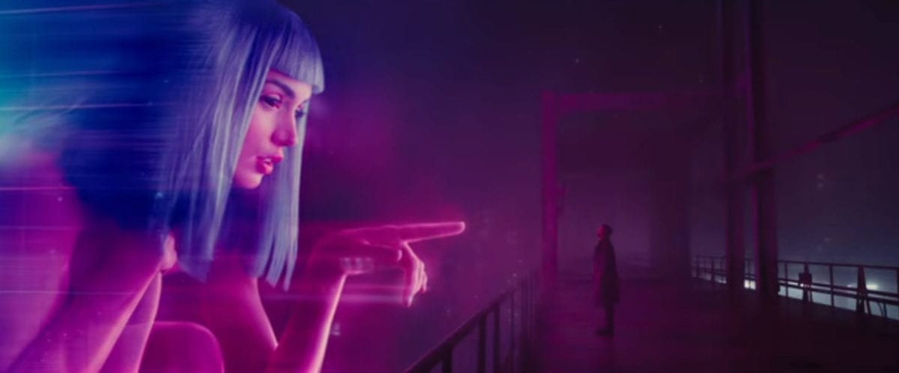

# Here's a webpage I created using a reference design.
The reference design I used came in the form of 2 images: one is an image of the complete website, and one has some details about some of the fonts and colors used.

Still from Denis Villeneuve, *Blade Runner 2049* .
